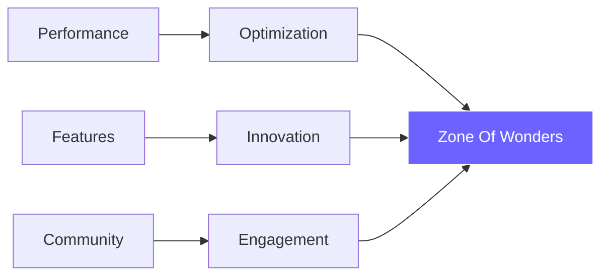

<div align="center">

# 🌌 Zone Of Wonders Repository ⚙️
### *Where Innovation Meets Adventure*

[](https://git.io/typing-svg)


[](https://github.com/MizzNotFound)
[](https://bit.ly/zowmc)
[](https://zowmc.com)

</div>

---

## 🎮 Network Information

```bash
╭─ Connection Details
├─ 🖥️  Java Edition    │ ZOWMC.COM
├─ 📱  Bedrock Edition │ PE.ZOWMC.COM:25565  
├─ 🌐  Website         │ zowmc.com
├─ 👥  Community       │ Discord Available
╰─ 🎯  Status          │ Online 24/7
```

<div align="center">
  
</div>

---

## 💎 About Zone Of Wonders

<table>
<tr>
<td width="50%">

### 🚀 Our Mission
We're building the next generation of Minecraft experiences through cutting-edge technology and passionate development.

**Core Values:**
- 🎯 **Quality First** - Every feature is crafted with care
- 💡 **Innovation** - Pushing Minecraft's boundaries
- 🤝 **Community** - Players are our foundation

</td>
<td width="50%">

### 🎮 Game Modes
```yaml
Skyblock:
  type: "Custom Enhanced"
  features: ["Advanced Islands", "Economy", "Quests"]
  
SMP:
  type: "Semi-Vanilla"
  features: ["Land Claims", "Custom Items", "Events"]

RPG:
  type: "Adventure"
  features: ["Custom Classes", "Dungeons", "Progression"]
```

</td>
</tr>
</table>

---

## 👨‍💻 Development Team

<div align="center">

| Avatar | Developer | Role | Specialization |
|:------:|:---------:|:----:|:--------------:|
|  | **[MizzNotFound](https://github.com/MizzNotFound)** | 🔧 Founder | Website & Database Architecture |
|  | **[Herzchen](https://github.com/Herzchens)** | ⚡ Backend Dev | Plugin Development & Systems |
|  | **[Deus](https://github.com/deus)** | 🎮 Game Dev | Configuration & Gameplay |

</div>

> 💬 **Want to contribute?** Join our Discord community and let's build something amazing together!

---

## 🛠️ Technology Stack

<div align="center">

### Server Infrastructure


### Development Tools  


### Languages & Frameworks


</div>

### 🏗️ Core Technologies

<table>
<tr>
<td align="center" width="25%">

**🖥️ Server Core**
<br><br>
<a href="https://github.com/PaperMC">
  
</a>
<br>
PaperMC

</td>
<td align="center" width="25%">

**⚡ Performance**
<br><br>
<a href="https://github.com/PurpurMC">
  
</a>
<br>
PurpurMC

</td>
<td align="center" width="25%">

**🚀 Async Engine**
<br><br>
<a href="https://github.com/Winds-Studio/Leaf">
  
</a>
<br>
Leaf

</td>
<td align="center" width="25%">


**⚡ Performance Engine**
<br><br>
<a href="">
  
</a>
<br>
AxolotSpigot

</td>
<td align="center" width="25%">

**🔧 Management**
<br><br>
<a href="https://github.com/Pterodactyl">
  
</a>
<br>
Pterodactyl

</td>
</tr>
</table>

---

## 📊 Network Statistics

<div align="center">


</div>

---

## 🌐 Connect With Us

<div align="center">

[](https://bit.ly/zowmc)
[](https://www.youtube.com/mizznotfound)
[](https://www.facebook.com/zowmccom)
[](https://zowmc.com)

</div>

---

<div align="center">

### 🎯 Current Focus



**"Building tomorrow's Minecraft experiences, today."**


---

*⭐ Star this repository if you love what we're building!*

[](https://github.com/MizzNotFound)

</div>
